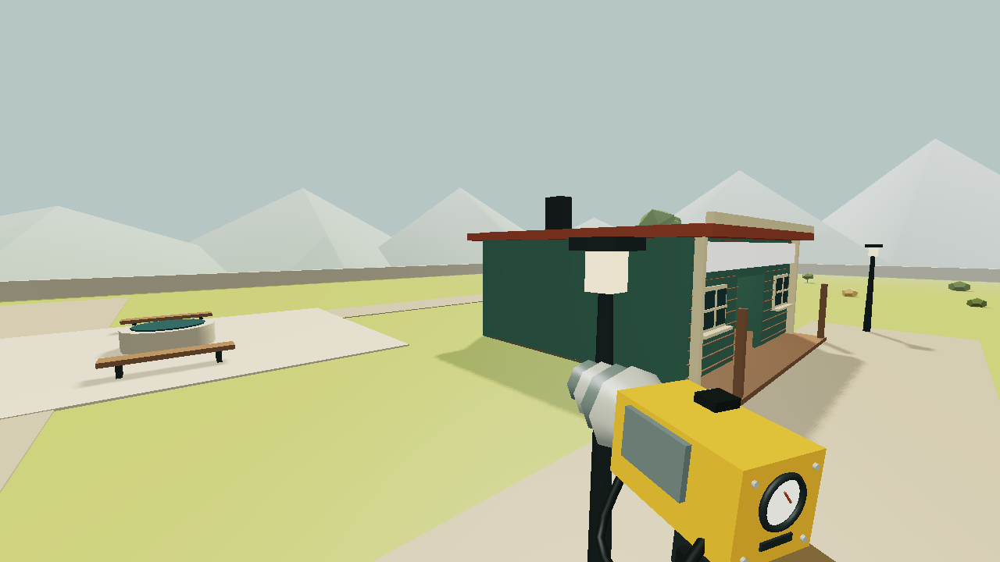
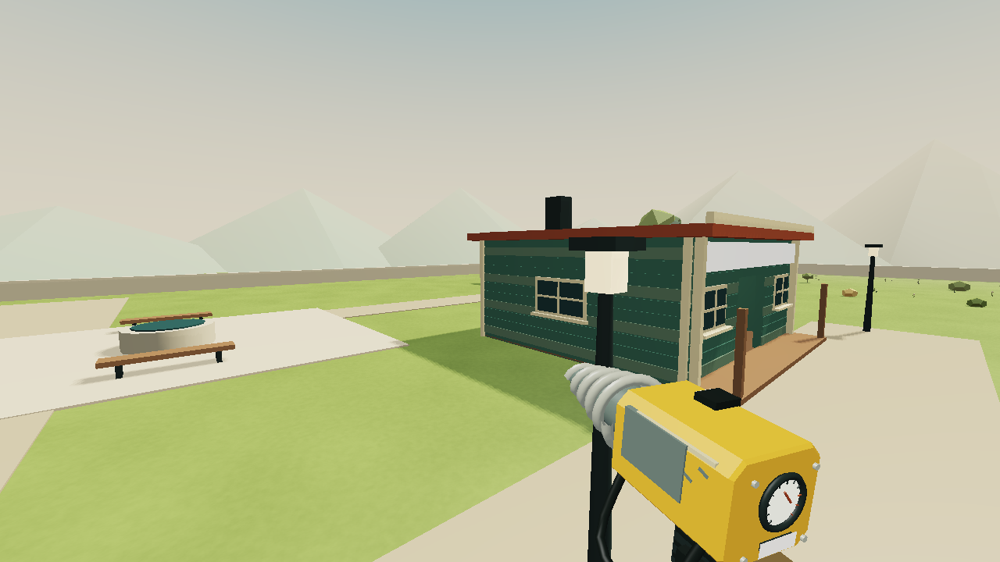
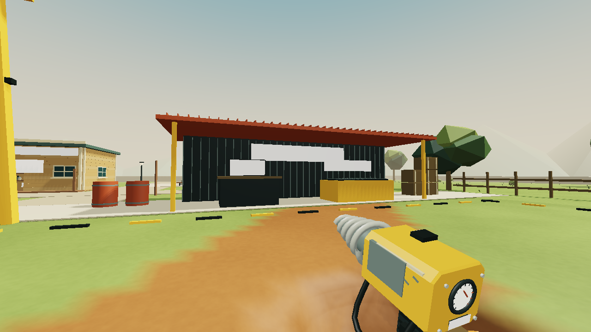

# Bell Works finish: local 2.19

This visual pass strengthens the existing low-poly art rather than changing the saved mine or its rules.

## Changes

- World-space terrain shading replaces the coarse checker grain with smooth mineral variation, sediment bands, chalk tint and small surface relief. Relief fades with distance and avoids degenerate derivative normals. The same finish covers the permanent grass outside the mine. Excavated surfaces receive it automatically, without UV seams or changes to density samples.
- The sky grades from a warm horizon to blue above, with a restrained sun glow. It follows the camera and fades out underground. The sun's shadow camera covers Ridge Common's three buildings. Lighting on the held tool follows the underground lamp temperature.
- Trees have distinct light, middle and shaded canopy colors. Grass tufts and small pale blooms dress permanent common land while leaving both mining parcels, roads, the service apron and shops clear.
- Shops gain full side and rear weatherboards, faded paint bands, corner trim and side windows. New trim sits outside the wall surfaces. Existing doorways, counters and collision volumes are retained.
- The cutter has a beveled housing, a helical drill bit, grip ribs, gauge ticks, painted markings, scuffed edges and a sleeve/glove treatment. The modular drill attachments retain their existing controls and tool behavior.
- The three upper cave networks have distinct decorative forms: lantern caps, hanging chalk roots and mineral clusters. They retain their seeded support anchors and disappear when that support is excavated. Existing ore remains physical and collectible.

`src/beauty.js` owns the terrain shader, sky, surface planting and shared art helpers. The terrain material is patched against the bundled Three.js shader chunks. `src/render.js`, `town-view.js` and `cavern-view.js` construct the updated scene. The grass vertex color in the surface mesher matches the surrounding land more closely. Save data and generation versions are unchanged.

## Verification and visual evidence

`node tools/test-beauty.mjs` checks gameplay-state isolation, camera/sky behavior, motion preferences, actual shadow-frustum coverage, planting exclusions, excavated formation support and shader integration. The aggregate suite includes these six cases. Completed counts and package evidence are recorded in VERIFICATION.md.

`python tools/verify-beauty-shaders.py` compiles and links the expanded terrain vertex and fragment stages from the installed Three.js library on standalone OpenGL. The adapter translates WebGL GLSL syntax to desktop GLSL. It catches integration errors without opening a browser.

The optional art study uses `node tools/export-beauty.mjs after`, then `python tools/render-beauty.py after`. It exports the actual scene meshes, transforms, material colors and procedural terrain functions, then renders them with ModernGL. It uses the existing Python ModernGL, NumPy and Pillow installation. The game does not depend on Python or these tools.

The yard, town, lantern workings, chalk galleries and violet undercroft were inspected offline on the RTX 5070 Ti. The images below are geometry/material studies using an approximate lighting, shadow and tone-mapping adapter. Canvas signs and the HUD are omitted. They are not browser screenshots and do not establish browser performance, final WebGL appearance or human play feel. No browser interaction, window activation or OS input was used.

| Before | After |
| --- | --- |
|  |  |

The broader art review remains open, especially the first-person attachments, human cave readability and final lighting in normal play. The published site remains 2.8.0.
