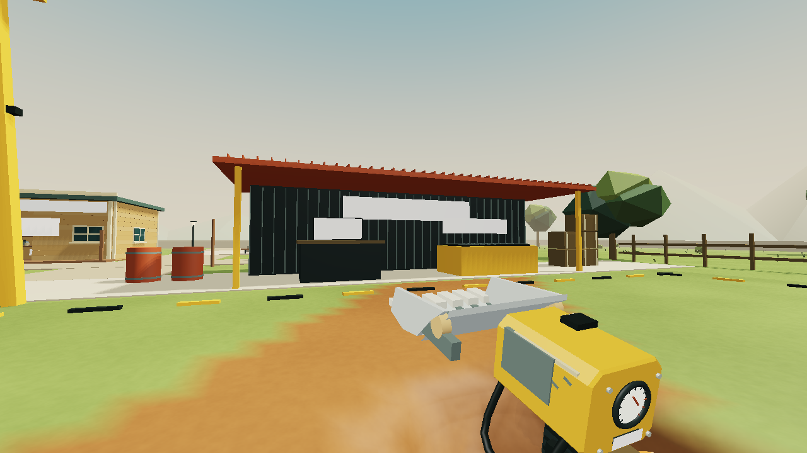
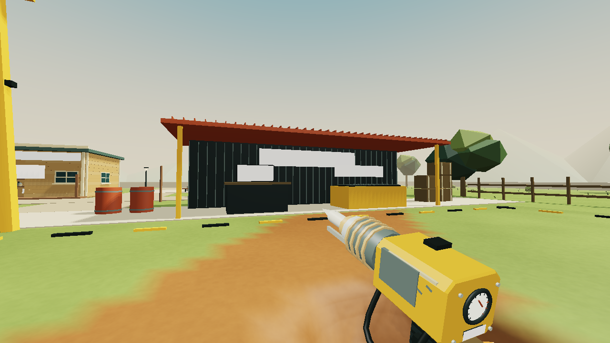
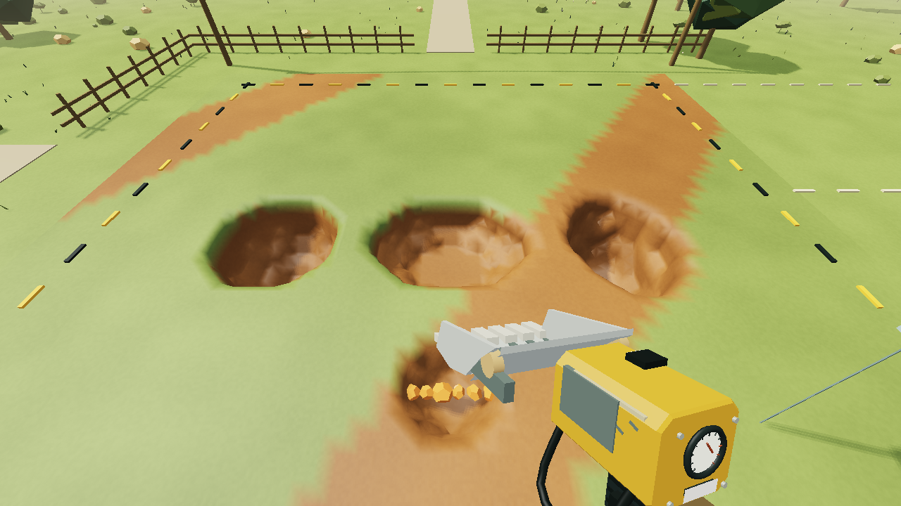

# Cutting response, local 2.21.0

The three mechanical tools previously varied radius and strength but all excavated spheres. Their working ends and feedback did little to communicate a different job. This checkpoint changes future cuts and adds mechanical response. It does not reset existing excavations or add another progression requirement.

## Tool behavior

The cutter retains its spherical volume and power. The scoop cuts an oriented ellipsoid with lateral, vertical and forward scales of 1.25, 1 and 0.7. It makes a broad, shallow working face. The lance uses 0.84, 1.05 and 1.45, making a longer, narrower bore. Both retain their existing upgrade radii, resistance rules and damage values. The orientation follows the player's aim. Corrected orthogonal edge probes continue finding the rim when the centre ray sees air, including on sloping cuts.

`World.carve` accepts an optional brush basis and axis scales. It keeps the original spherical path, checks ownership and protected floors at every sample, and uses the same chunk halo and mesh updates. The enclosing radius also reaches every support listener, so minerals, lamps and machinery are reconsidered throughout an elongated cut. Existing terrain fields and save schema remain unchanged.

## Presentation

The scoop has a formed bucket, side cheeks, hinge pins and replaceable teeth. The lance has a segmented barrel, collars, guides and a moving striker. A read-only `MiningFeel` system follows actual edits: motor speed rises on the trigger, loading slows the cutter, the scoop works through a slower stroke and the lance reciprocates rapidly. Mechanical animation changes only the held tool. It never changes player look or camera orientation. Tool motion can still be disabled.

Eight small contact ticks trace nearby rock at 15 Hz. Each has a real ray hit, a surface normal, an unobstructed line from the player and depth testing; they do not stretch a decal across an open hole. Common land is marked red. They indicate contact around the cutting footprint, not an exact preview of the final cavity. Menus, explosive aiming and creature targeting hide them.

Cut debris uses the normal captured before excavation. The scoop emits a wider dusty fan; the lance emits faster chips with less dust. Tool loading changes motor pitch and filtering. Actual excavation triggers bounded grit, bucket-bite or chisel sounds; air and protected ground produce no impact beats. Axe, sling and magic no longer use the mechanical motor loop. Presentation adds no drilling delay, camera shake, fuel or durability.

## Verification

`tools/test-mining.mjs` adds eleven checks covering the brush basis, directional cut profiles, exact old spherical behavior, protected samples, loose-ore support, cold mesh equivalence, real action integration, read-only previews, cadence, finite attachment geometry, motion settings and procedural sound samples. Aggregate and earned campaign receipts are in VERIFICATION.md.

`node tools/export-beauty.mjs tools-221 --mining` exports actual attachment and excavation geometry. `python tools/render-beauty.py tools-221` renders it offline on the GPU. Lighting is approximate, signs are omitted, and the comparison pits are deliberately constructed fixtures. These are not Firefox screenshots or evidence of earned progress.

Human feel, sound balance and final browser appearance still need normal-play review. The next art priority is the residents and their shops, followed by the empty common and underground landmarks. The broader beauty/gameplay goal remains open. The published site remains 2.8.0.
