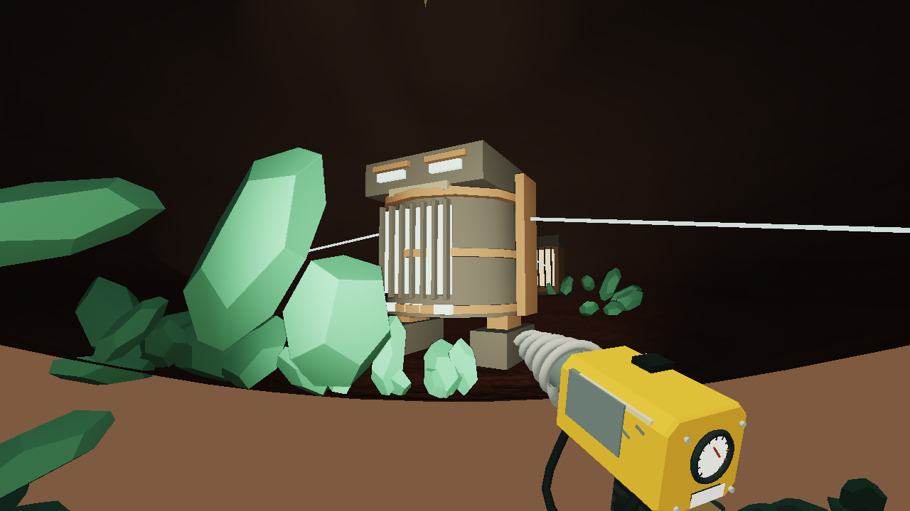
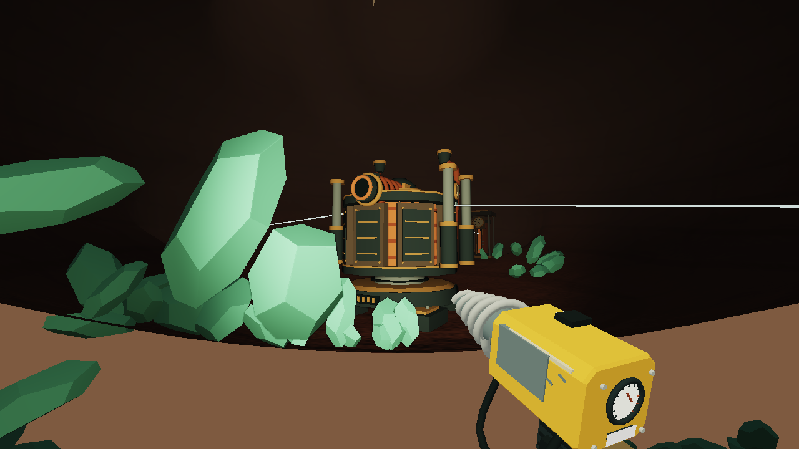
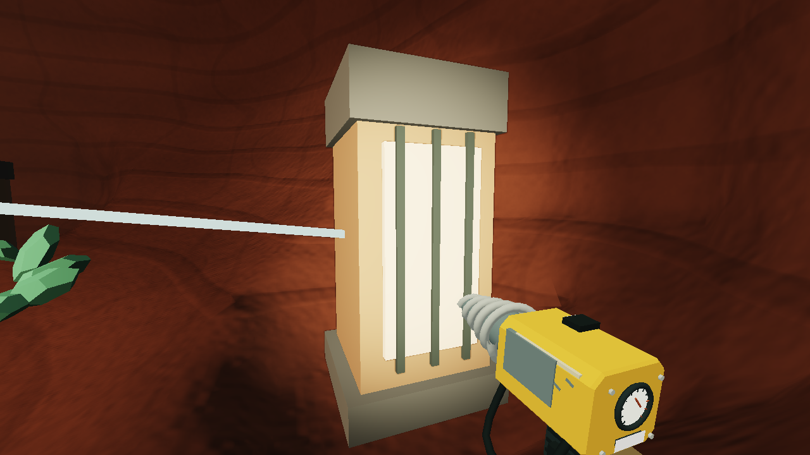
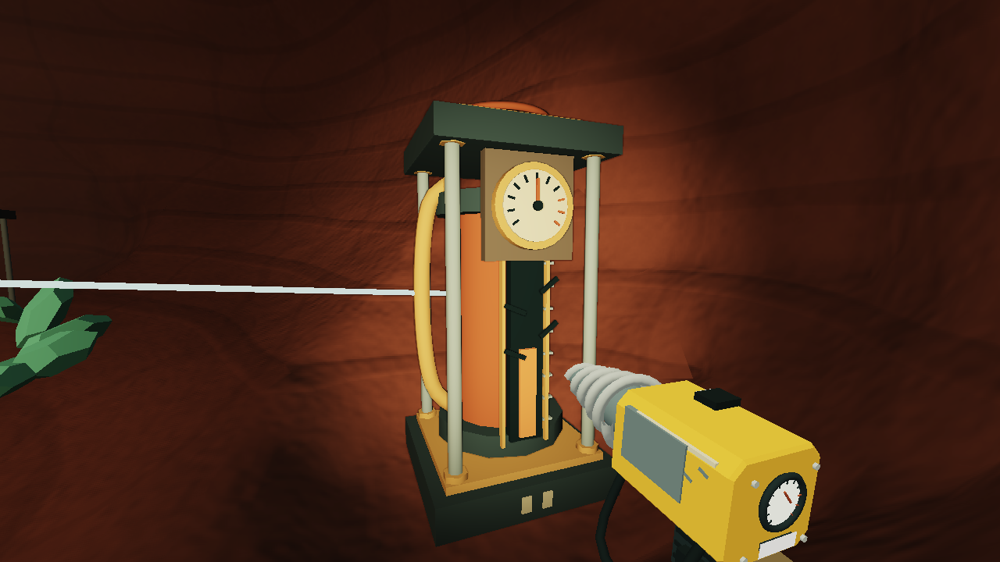
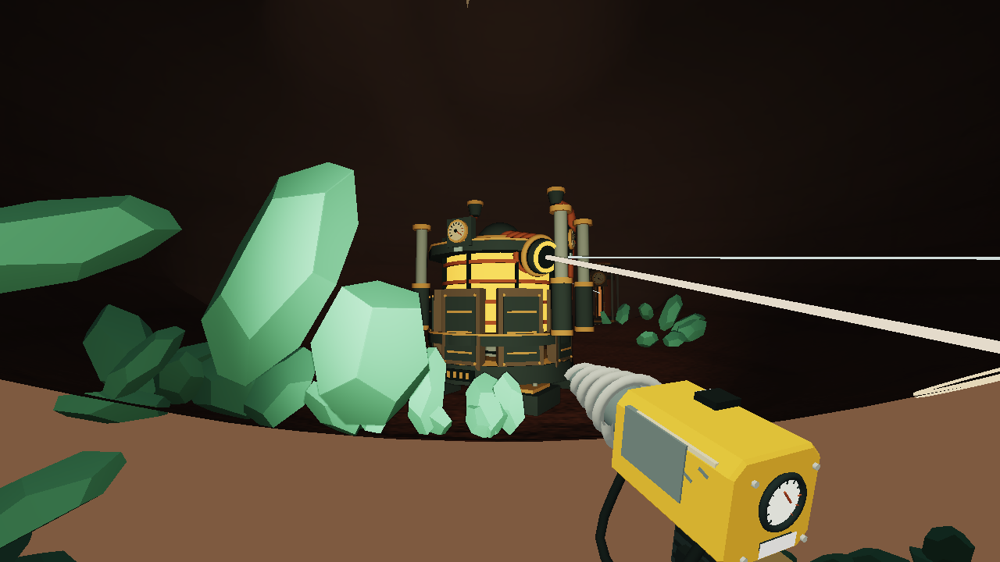
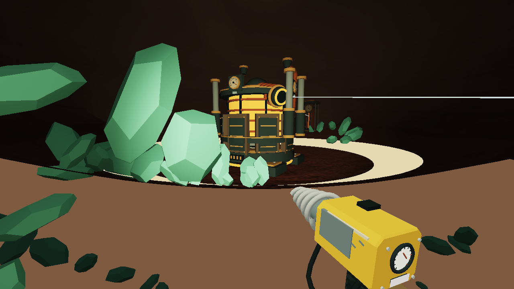

# Under pressure: local 2.25.0

The Foreman now has a rotating cutting head, eight retracting furnace shutters, piston legs, copper manifolds, three pressure instruments and a ground-shock ram. Its separate locks have pressure columns, marked gauges, valves and visible damage. This is an encounter presentation pass on the existing fight.

## Reading the fight

- Breaking a lock drains its pressure column and turns its valve. The matching instrument on the furnace also drops, and its indicator changes color.
- The armor retracts downward whenever the core can take more damage. After the available health segment is spent, it closes again. The exposed glow surrounds the body; damage still works around the whole physical target.
- The cutting head turns toward the committed shot. Moving after the warning starts does not make the head track you. Its telescoping barrel retracts at steep upward angles to fit the physical body.
- A circular mark identifies the cutting jet's terrain impact. The fired jet keeps its recorded endpoint after the blast cuts into the wall and after a save/reload.
- The ram lifts during the ground-shock windup. The traveling warning follows supported ground within the actual attack's height band and clear path. Rock cover, holes and high ledges leave breaks in the warning.
- Broken machinery stays in the mine, including its saved location if you undermine it. Victory leaves open, cooled furnace shutters and retains the existing powered common and foundry bore reward.

These signals remain available with Tool motion disabled. There is no camera shake or alteration of player look. The body dimensions, HP, timing, damage, rewards and save schema remain the same. The shared ground-shock reach query expresses the existing damage rules; it does not add a new attack.

## Geometry studies

These are actual production scene geometry rendered through an offline GPU adapter. Lighting and transparency are approximate, mapped sign text is omitted, and these are not browser screenshots. Both versions use the same cameras and exposed, settled machinery. Combat phases and injuries are set directly for inspection, not earned in play.

| 2.24 | 2.25 |
| --- | --- |
|  |  |
|  |  |

## Verification boundary

Six new furnace-art checks exercise 56 aiming poses against the existing physical bodies, real lock/core damage and gate changes, committed aiming and impact position, ground-shock gaps, portable reconstruction and rendering without gameplay-state mutation. The twelve original furnace checks also pass, covering actual drill/axe/explosive damage, shielding, lift avoidance, fixed-step timing, saved shots, undermining, rewards and forge use.

The complete-suite and portable-build receipt is in [VERIFICATION.md](VERIFICATION.md). The latest earned full campaign remains the 2.21 fossil journey. This presentation checkpoint does not establish normal-play visibility, frame rate or enjoyment. The broader beauty goal remains active, and publication remains at 2.8.0.

## Reproducing the studies

Run `node tools/export-beauty.mjs foreman-225 --foreman`, then `python tools/render-beauty.py foreman-225`. The optional `--foreman-baseline` reads `tools/out/foreman-224-view.js`; the recorded baseline is `git show 14fa2b2:src/foreman-view.js`. The adapter never starts a browser or sends OS input.

## Follow-up

Judge the fight from normal first-person play with the in-game HUD, work lights and large ore piles present. The new head and armor signals should reduce reliance on text, but that needs a human play review. Broader authored chamber art, discovery staging, creature presentation and additional enemy variety remain separate work in the durable expansion plan.
