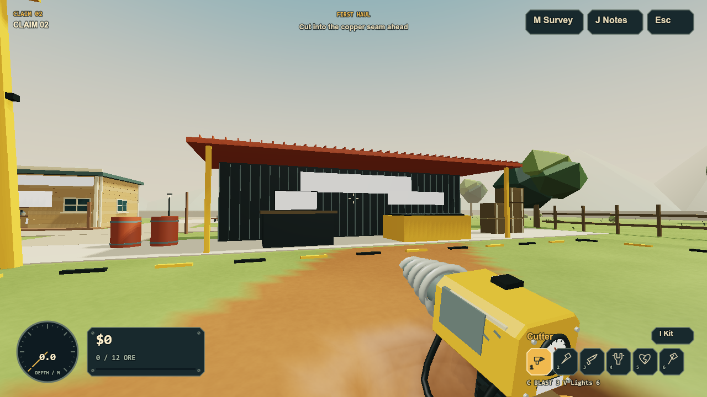
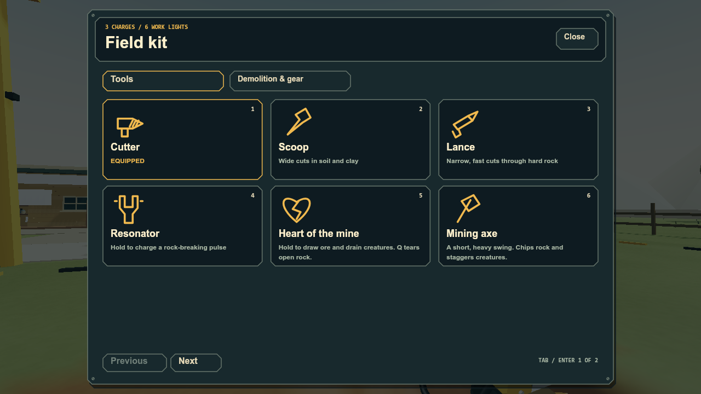
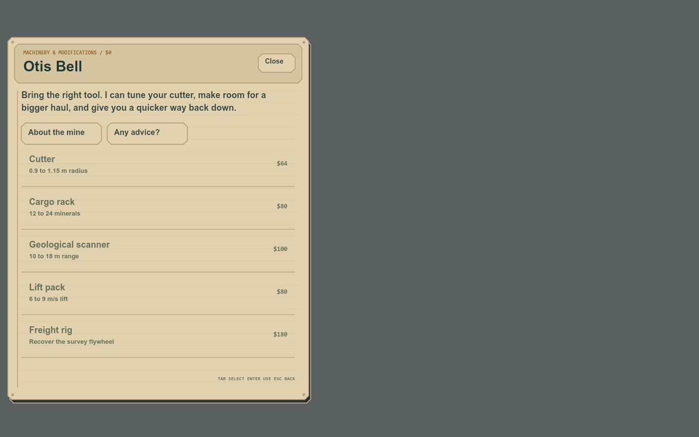

# Field instruments, local 2.20.0

Trent's review of 2.19 was explicit: the feature count had grown, but the game still felt like the same prototype, the terrain border was visibly open, and the HTML UI was unwelcome. This checkpoint replaces visible UI rendering and fixes the border. It does not establish that the wider game is now beautiful or satisfying.

## What changed

`src/game-ui.js` paints the interface into a canvas texture and composites it through a dedicated Three.js scene after the world and held tool. Its material is transparent, unlit, unaffected by tone mapping, and independent of world depth. The game canvas is the only visible normal-play surface. No DOM screenshot, SVG screenshot, CSS panel or HTML overlay is used for visible UI.

The HUD has an analog depth instrument, a compact cash/cargo readout, illustrated tool slots, contextual prompts, combat health/armor, scanner results, tool charge and recall meters. Field kit tools sit in a case; demolition and equipment instructions have their own tab. Shops and field notes use a ruled ledger. Town commerce sits to the side so the resident remains visible; the held tool is hidden during conversations.

All existing screen states have game-rendered views: title, pause/settings, field kit, town, workshop, survey, journal, controls/credits, freight, rescue, discovery, upper-mine milestone, furnace victory and new-claim confirmation. Survey plan and vertical profile use explored data; recorded signals and mineral focus remain available. Large lists paginate. Canvas input supports hit regions, Tab/Enter navigation, wheel/page navigation, touch movement, held actions and cancellation. The canvas exposes a changing accessibility label for menu focus. Rendering paints at up to 20 Hz and composites each frame.

The old HTML controls remain inside a hidden, inert transaction model while existing economy, notes and service callbacks are reused. They never render. Removing that compatibility model is later architectural cleanup, not a claim made by this checkpoint. The native import file picker and download mechanism remain browser facilities. The file input is outside the inert model.

## Two bugs fixed alongside the interface

Surface Nets produces a flat outer boundary at -16.25 and 15.75 m, but surrounding ground began at -16 and 16 m. The positive edge had a quarter-metre slit; the negative edge overlapped. The common-land strips and unowned Eastcut cap now meet the actual mesh coordinates. This changes only surface geometry. It does not fill excavations or alter ownership, density, ore or collision.

The old import button rejected files above 6 MB even though full-depth portable exports exceed that size. The input limit is now 32 MB; structural save validation still runs before installation. A full-depth exported claim passes through the actual import-file handler and retains its field, money and preferences.

## Evidence and limits

```text
node tools/test.mjs
COMPLETE 276 system checks passed

node tools/test-interface.mjs
COMPLETE 10 interface checks passed

node tools/build.mjs
PASS standalone: 49 scripts compile; no external scripts or stylesheets.
```

The new checks exercise canvas hit events, keyboard menu actions, counter purchases, tool/charge unlocks, map depth/profile controls, settings, touch cancellation, screen/page bounds at desktop/laptop/phone sizes, 80 ray tests across the actual four mesh borders, and a portable save through the file-import route. The test harness now dispatches capture handlers before existing game input. Its town Tab assertion changed deliberately: the canvas menu now owns focus navigation.

`tools/export-interface.mjs` uses a native canvas implementation to execute the actual paint code. Its optional development dependency is installed only under ignored tool output:

```text
npm install --prefix tools/out/ui-render --no-audit --no-fund @napi-rs/canvas
node tools/export-interface.mjs
```

The export covers desktop, laptop, touch and a populated late-game journal. The 3D backdrop in the following studies comes from the offline geometry renderer, with approximate lighting and omitted canvas signs. These are not Firefox screenshots. Native 2D painting, pure input dispatch and shader/program builds do not prove browser compositing, file-picker behavior, frame rate, accessibility quality or human enjoyment. No browser interaction, pointer capture or OS input automation was used.







## Continue from here

1. Prioritize the feel of ordinary excavation: contact, cutter response, shaping readable spaces, collection feedback and the reason to return for an upgrade. Avoid treating another feature as proof of better play.
2. Rework the residents' heads, hands, proportions and shops. Trent's close-up of Otis makes the weak character art clear. Then address the empty, flat town surroundings and repetitive props.
3. Continue environmental art and underground landmarks with readable lighting and clear physical boundaries. Review against actual human screenshots.
4. Ore mimics remain in the expansion plan, but are deferred behind the above work. No mimic gameplay shipped in 2.20.

The published site remains 2.8.0. The larger beauty/gameplay goal remains active. This is a local UI checkpoint.
