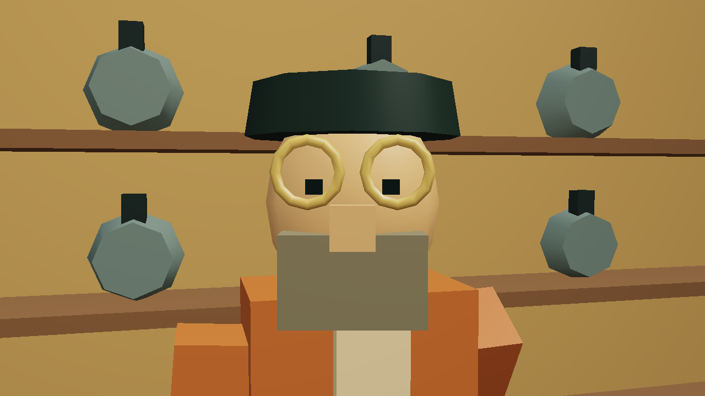
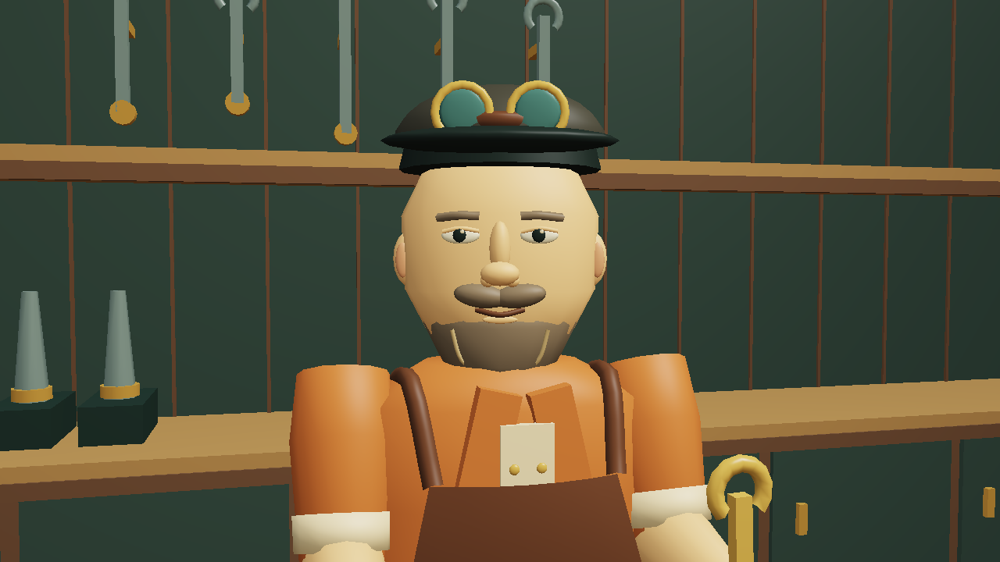
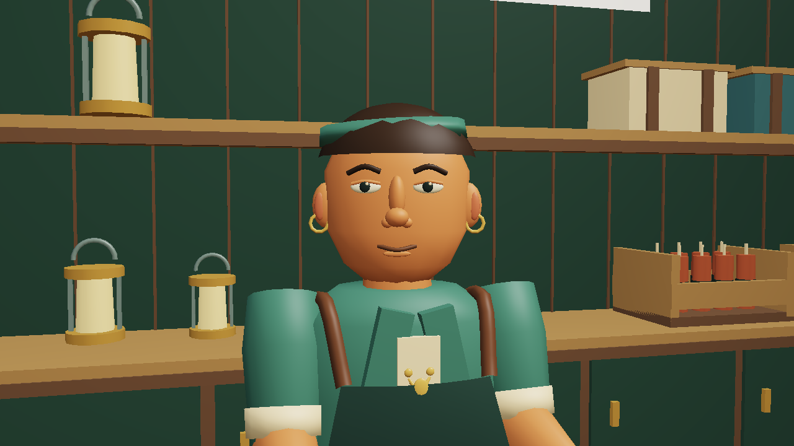
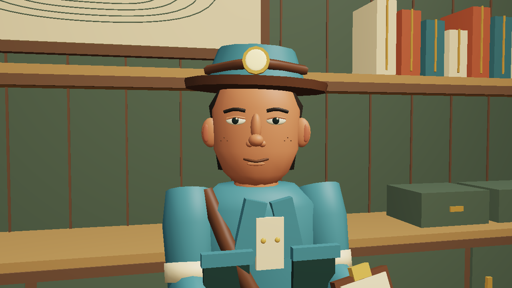
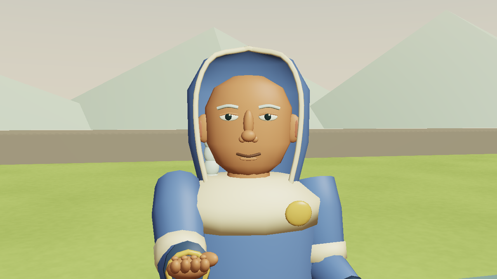
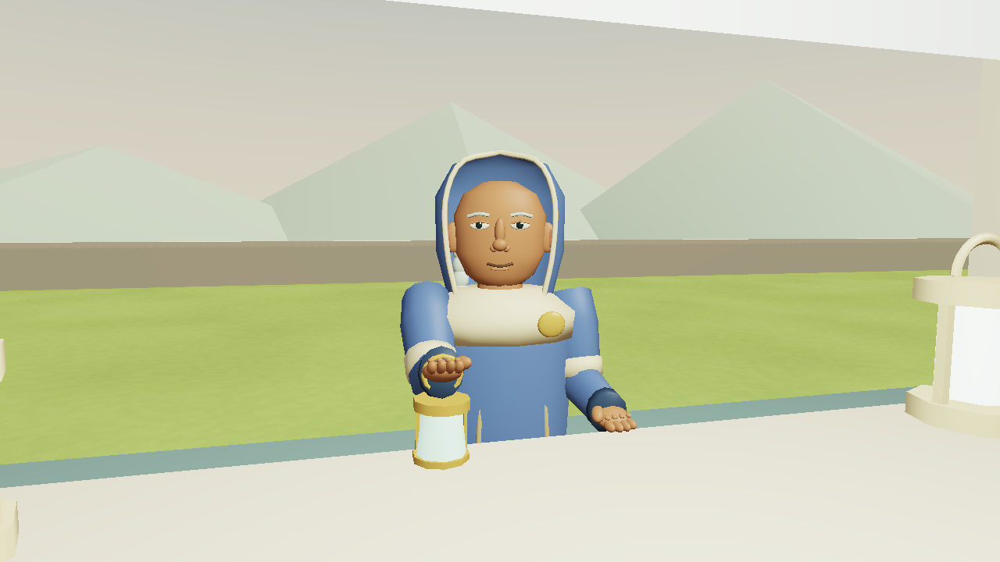

# Faces in the common, local 2.22.0

Trent's Otis screenshot exposed the old character model at conversation distance: oversized goggles, a block nose and beard, rigid arms and a wall of repeated props. This checkpoint replaces the four resident models and stages their workplaces. It preserves their roles, prices, dialogue and progression gates.

## Characters

`src/residents.js` builds shaped heads, smaller eyes and lids, brows, noses, ears and mouths. Coats have a waist, shoulders, collars, seams and pockets. Two-link arms end in palms and fingers. Trousers taper into boots. The proportions fit the existing stations and collision height; Inez's scaled model still fits inside the rescue bell.

Mara wears a tied band, bun, earrings and work apron. Otis wears a leather apron and a cap with raised goggles, a shaped beard and a held wrench. Inez carries a notebook and wears a headlamp, satchel strap and pocketed survey coat. Nell has a lined hood, braid, scarf, brooch and held lantern. Cloth intersections found in the first close-up render were corrected before packaging.

The rigs look toward a nearby player, blink independently and move their forearms subtly. This also runs during a conversation. The Tool motion preference freezes their animation; pause menus do too. Rendering never moves the player or changes aim, inventory, terrain or conversation progress. Static pieces are combined in their local limb space so animated pivots remain intact.

## Workplaces

`src/shops.js` gives the three buildings dark backboards, cupboards, shelf supports, counter panels, practical pendants and distinct stock. Mara has lamps, wrapped charges, a weighing scale and ore samples. Otis has hanging wrenches, gears, drill bits, a small motor, bench vise and rotor. Inez has survey volumes, rolled maps, drawers, a contour board and compass. Mugs have handles and dark interiors.

Back cabinets have physical bounds. The customer approaches and conversation lines stay clear. A warm counter fill activates near a visible, available merchant and switches off through walls, underground and before Inez returns. Existing saves inside newly solid stock use the existing obstructed-position recovery path without losing their mine or economy.

The visible interface continues to render through the game canvas. This update does not restore HTML panels or add browser dependencies.

## Evidence and limits

Seven new checks cover finite geometry and bounds, resident arrival gates, animation isolation, motion settings, cabinet collision and customer access, conditional lighting, and an older saved position inside a cabinet. Existing town checks walk through both merchant doors, buy supplies and equipment, test conversation visibility and preserve saves. VERIFICATION.md records aggregate results and the package receipt.

These images use the actual exported geometry, rendered offline on the GPU. The portrait camera uses a 36-degree field of view for inspection; normal gameplay remains 72 degrees. Lighting is approximate and canvas signs are omitted. They are not browser screenshots. Inez and Nell are enabled as art fixtures here; their earned unlocks are verified separately by the progression tests and prior journeys.

The latest earned full campaign remains the 2.21 fossil journey. This art checkpoint does not establish improved enjoyment or final browser appearance. The broader beauty goal remains open: the empty common, landscape, paths and underground landmarks need further work. The published site remains 2.8.0.
