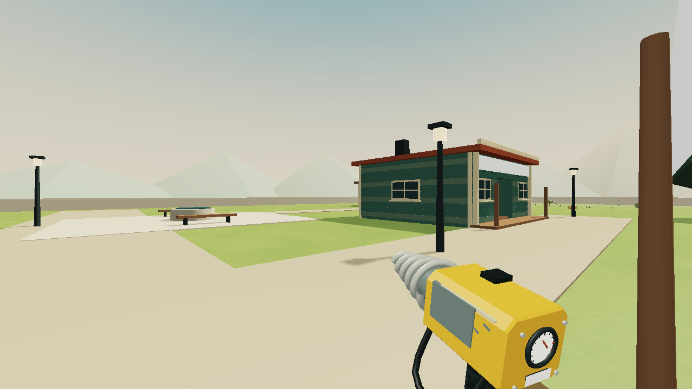
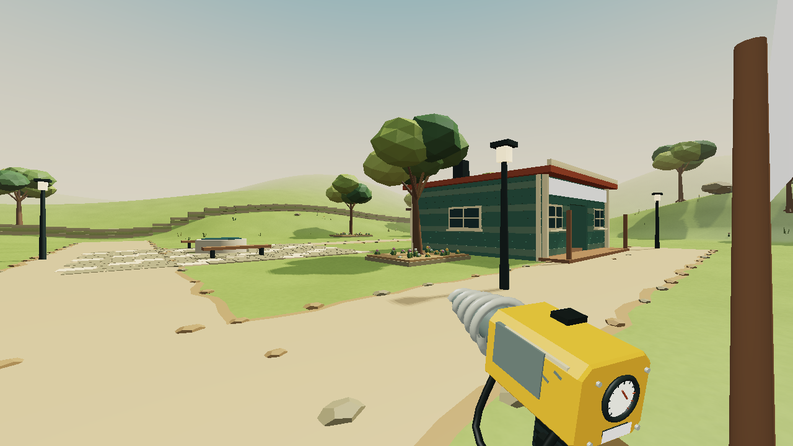
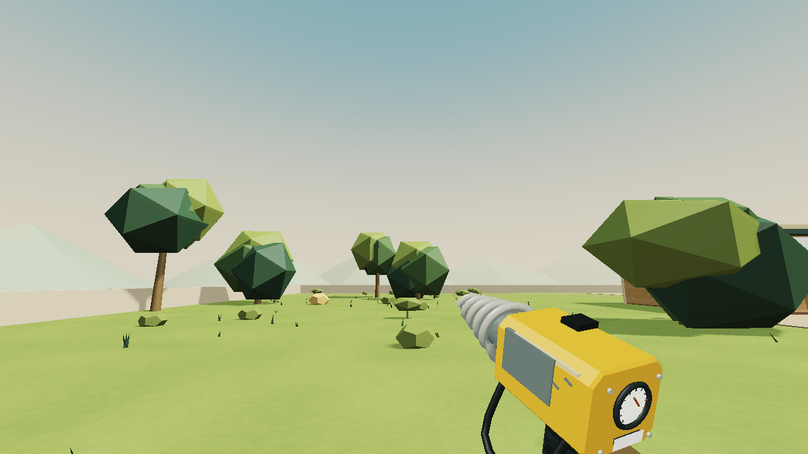
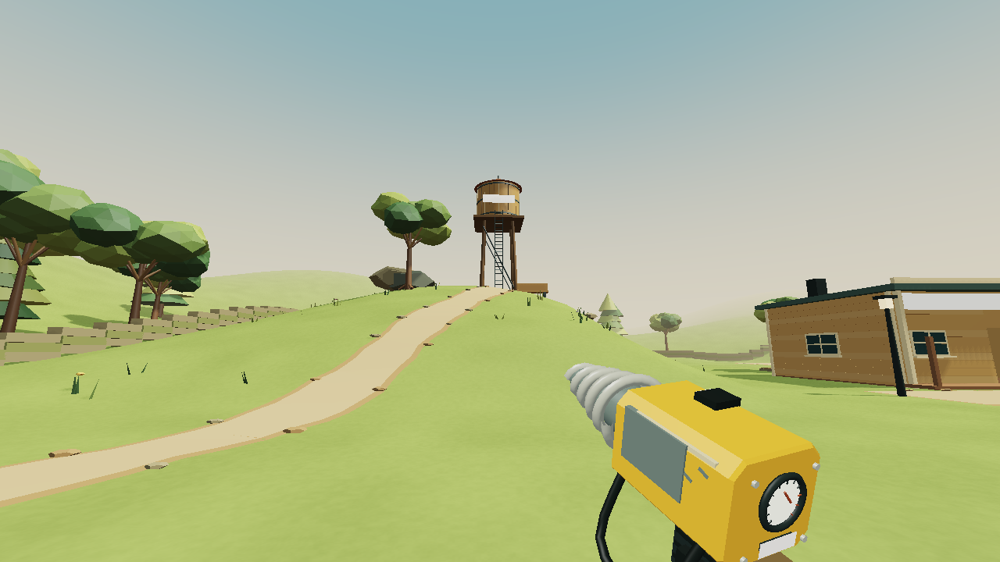
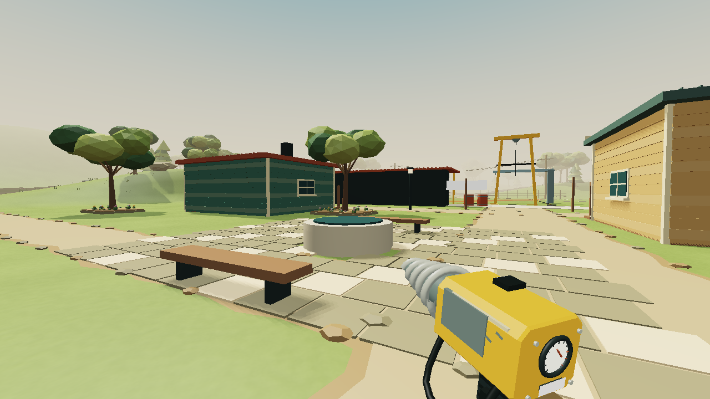
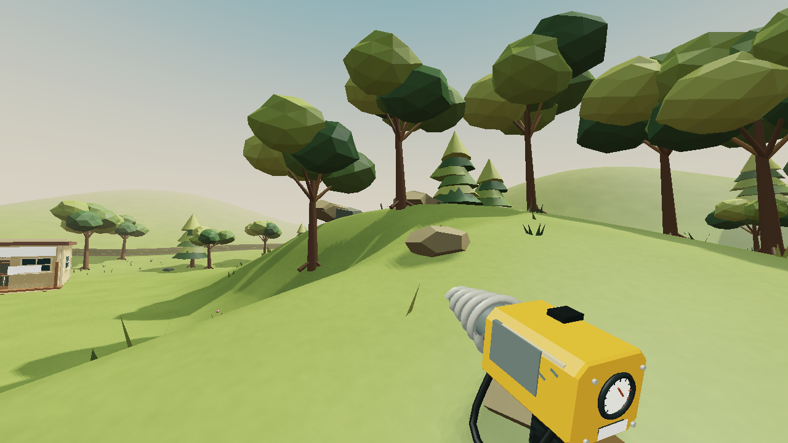
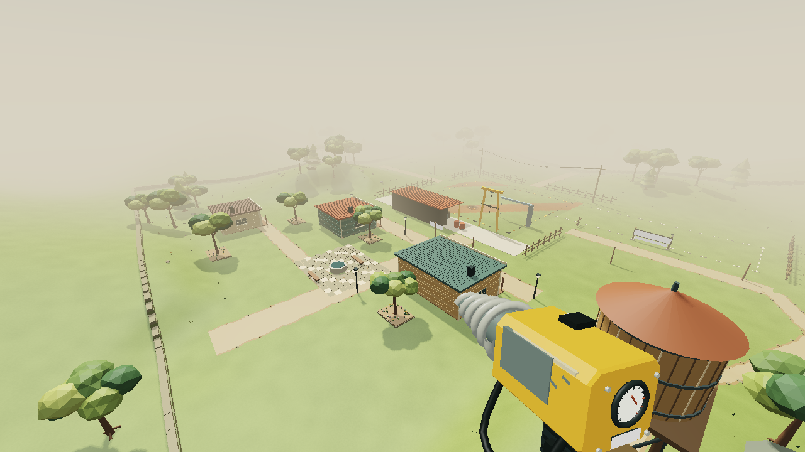

# Ridge Common landscape: local 2.23.0

The flat common is now a small settlement between walkable rises. A winding trail climbs the eastern ridge to a timber reservoir, with a bench looking back toward the claim. Broadleaf stands, conifers, exposed rock, gardens and a stone-paved well square give the route more landmarks. Dirt paths with rough shoulders replace the pale rectangular roads. The old cone mountains and continuous perimeter slabs are replaced by rolling terrain and stone courses that follow the ground.

This is a surface checkpoint in the larger beauty pass. The visible interface already renders in the game canvas through Three.js; the rebuilt residents, stocked shops and distinct scoop/lance behavior remain included.

## Shared ground and persistence

`COMMON` in `src/town.js` defines the paths and a triangulated two-metre height grid. `World.density` uses that surface outside the excavation envelope. `src/common-view.js` renders the same triangles, clipped to the exact fractional Surface Nets borders. Clipping preserves each original diagonal; simply shifting a grid column would introduce a small contact mismatch.

The original mine, Eastcut, shop foundations, service apron and existing gate approaches remain level. Neither saved density field is regenerated. Ownership is unchanged, and the common cannot be excavated. There is no uneditable ground mesh under either mine.

Older saves on the former flat common rise to the new ground at their original X/Z position when the player capsule fits. If new solid scenery occupies that spot, the existing safe claim-entrance recovery remains available. Money, equipment, minerals, excavation and resident state are retained. The surface is deterministic presentation data and does not add another save format.

Trees, outcrops and the reservoir have player collision. The winding route is traversable using ordinary walking. The reservoir is a visual destination, not a new upgrade or supply service. No new fetch quest, resource clock or upkeep is introduced.

## Inspection and verification

`node tools/test.mjs` passes all 301 system checks. Its receipt is `tools/out/verification-2.23.log`. `node tools/test-common.mjs` passes seven production-system checks. They cover level field joins and shop approaches, 450 mesh/contact ray comparisons, a complete walk to the reservoir and back, protected ground, scenery support and solid bodies, older save relocation, and read-only rendering. The walking capsule reaches 6.28 metres above the old plane without using lift. Existing town and interface checks cover doors, transactions and the repaired mine-border seam.

`node tools/build.mjs` produces a 1,196,384-byte standalone file. All 54 scripts compile with no external scripts or stylesheets. The expanded bundled terrain shader compiles and links on the standalone GPU check.

The images below are actual exported scene geometry with the normal 72-degree camera. The offline renderer uses approximate lighting and omits canvas sign text. They are not Firefox screenshots and do not establish runtime performance or human enjoyment. The production campaign has not been rerun for this surface pass; the latest complete earned route remains the 2.21 fossil journey.

## Next work

Strengthen underground landmarks and lighting, especially the first natural cave and the major discoveries. Preserve clear navigation and the player's placed-light choices. Normal-play review of the full interface, tools, character work and town is still needed. No further browser interaction tests or OS input automation are permitted in this session. The broader goal remains active; the published site remains 2.8.0.
