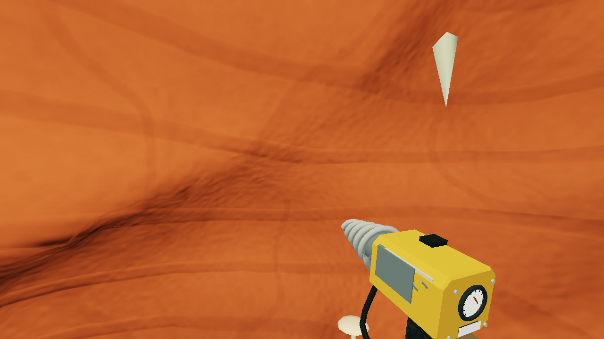
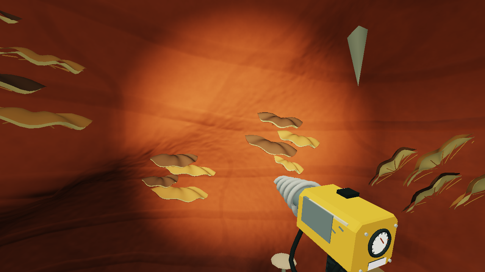
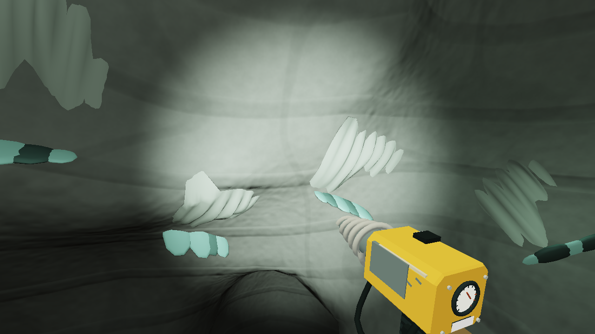
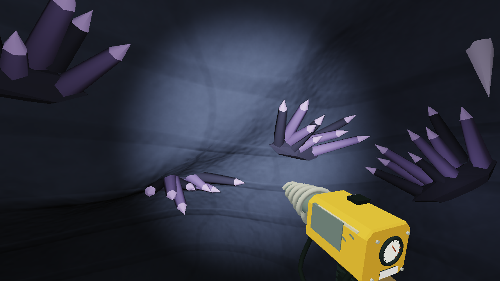
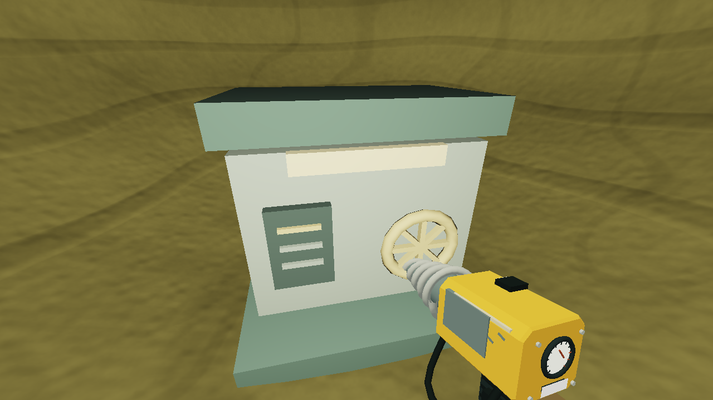
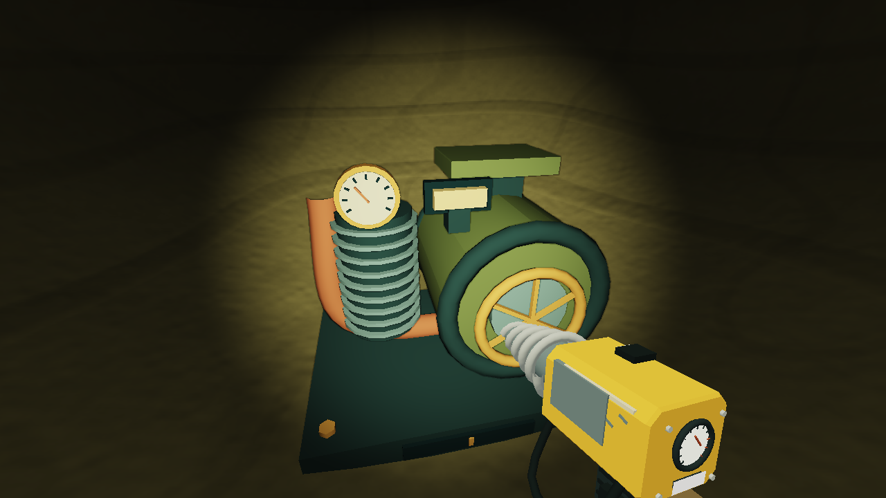
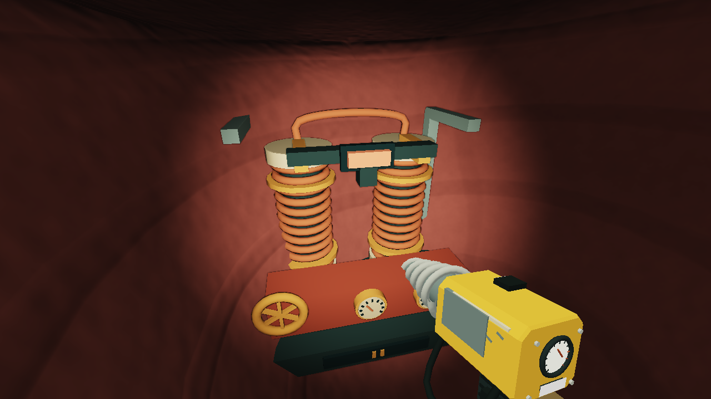
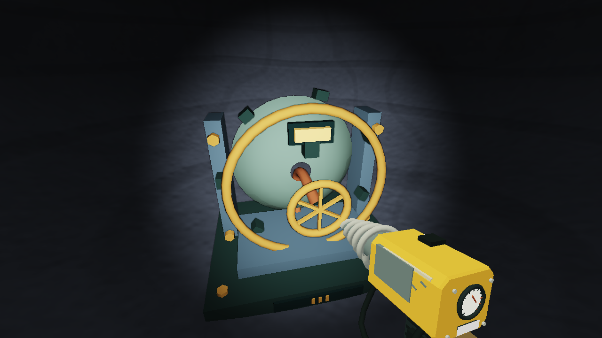
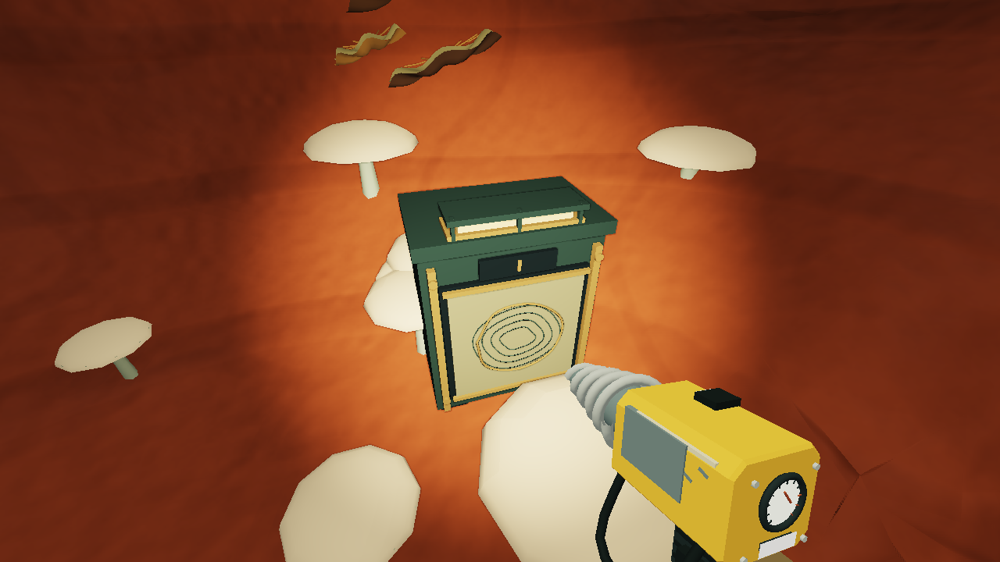

# Light and old workings: local 2.24.0

Three natural caves now have different wall silhouettes: layered amber shelves, chalk drapery and violet crystal fans. A focused headlamp replaces most of the broad camera light, giving nearby rock a lit center and darker edges. The lower pump, exchange and receiver now have separate machinery models instead of three copies of one cabinet.

## What changed

- The rootworks station has a volute pump, cooling fins, pipework, a marked pressure gauge and a moving flywheel.
- The ashfall exchange has paired wound coils, ceramic insulators, copper connections and instruments.
- The foundry receiver has a concave dish, feed pipe, outer ring and supporting frame.
- Survey cabinets have guarded lamps, fasteners, rolled charts and a small contour drawing. Their route trace is derived from the associated cave network.
- Wall formations conform to the curved original cave surface. They disappear when their rock anchor is excavated and remain absent after save/reload. Small local glows require exposed support and a clear line through rock.
- The headlamp follows actual aim without changing the camera or controls. Its spot shadow uses underground terrain as an occluder. A dim, short-range fill keeps nearby movement readable.

The headlamp uses a 768-pixel shadow map. Render scale below 1 disables its shadow pass while retaining the light. The sun shadow remains cached until existing scenery/terrain invalidation requests a refresh. Placed work lights and repaired lamps keep their broader coverage and existing creature-protection behavior. Decorative cave glows do not grant refuge protection.

## Implementation and persistence

`src/underground-view.js` builds the models, attached formations and headlamp. Existing `cavern-view.js` and `deep-view.js` continue to move physical nodes and apply repaired-state lighting. The new station geometry fits the original 2.2 x 2.1 x 1.8 m bodies; cabinets fit the original 0.95 x 1.16 x 0.65 m bodies. Support, repair costs, rewards, return points and saved nodes are unchanged.

Formations use the original world generator as a placement reference, then query the current field for remaining support. They do not regenerate terrain or decorate the newly cut faces of a saved excavation. Geometry is conformed to the curved wall before being placed, avoiding gaps from a flat tangent-plane attachment. Central cave routes remain clear.

No save format, terrain generation version, progression gate or economy value changes in this pass. The visible interface continues to render in the game canvas through Three.js.

## Verification and inspection

All 308 system checks pass; the aggregate receipt is `tools/out/verification-2.24.log`. The seven focused checks in `tools/test-underground-art.mjs` cover physical model extents, distinct supported formations, central route clearance, headlamp aim and quality settings, rock-occluded glows, excavation and reload, node movement, repaired lenses and exact gameplay-state preservation. `tools/verify-beauty-shaders.py` compiles the expanded bundled terrain stages both without shadow defines and with directional plus spot shadows.

`node tools/build.mjs` creates a 1,208,247-byte portable file. All 55 scripts compile without external scripts or stylesheets. The latest earned full campaign remains the 2.21 fossil journey. This art pass does not rerun that route.

Nine original camera views were exported with `node tools/export-beauty.mjs underground-224 --underground` and rendered on the RTX 5070 Ti using `python tools/render-beauty.py underground-224`. The offline adapter now reads the production headlamp cone and shadow camera. Lighting and shadows remain approximate, and canvas sign text is omitted. These views are not browser screenshots or runtime performance measurements. No browser interaction or OS input automation was used.

## Still open

The broader goal is not complete. Major authored discovery spaces and encounter presentation need further work, and normal play must assess the accumulated UI, digging, character, landscape and lighting changes. Actual browser frame rate, shadow quality, visibility during combat and enjoyment remain unverified. Preserve the session's prohibition on further browser interaction tests. The published site remains 2.8.0.
